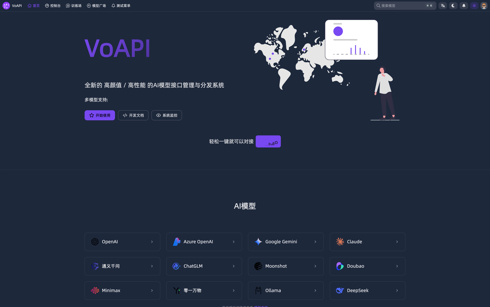
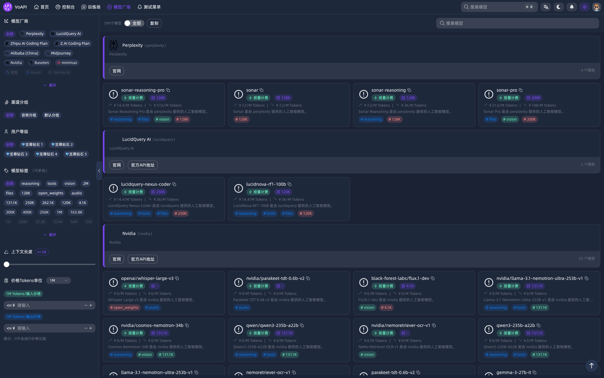
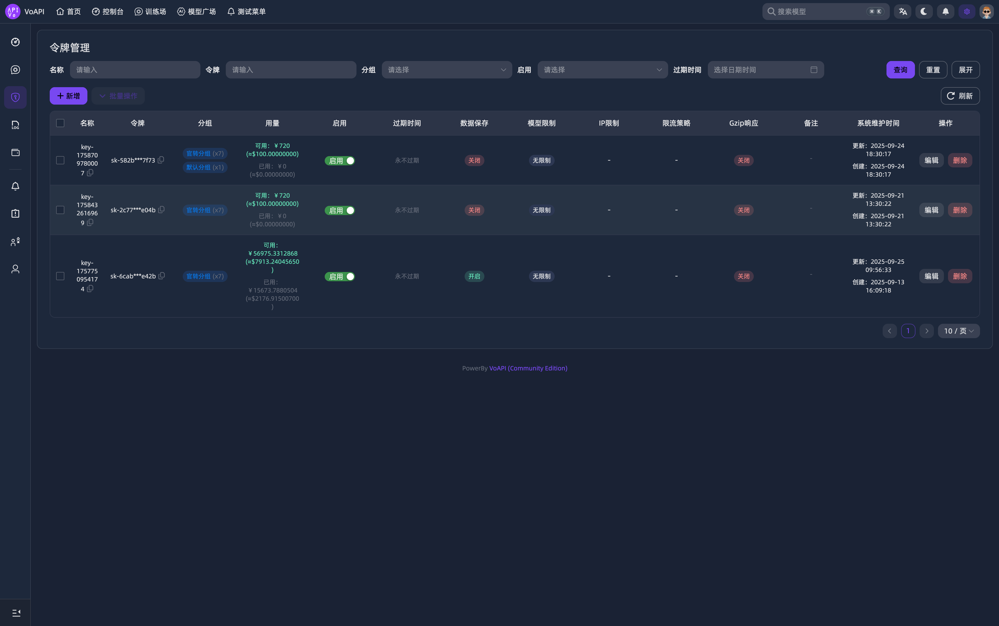
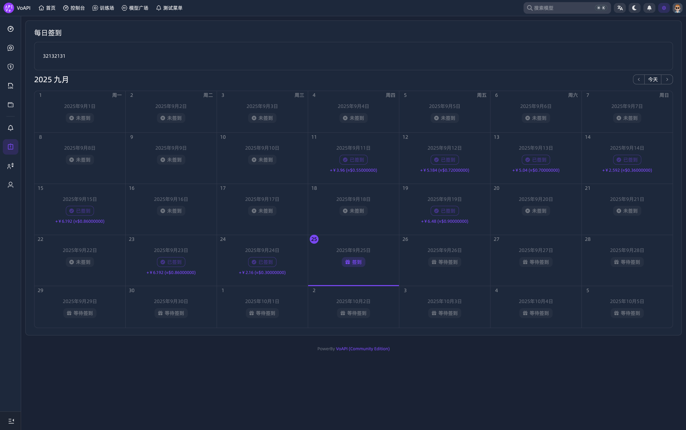
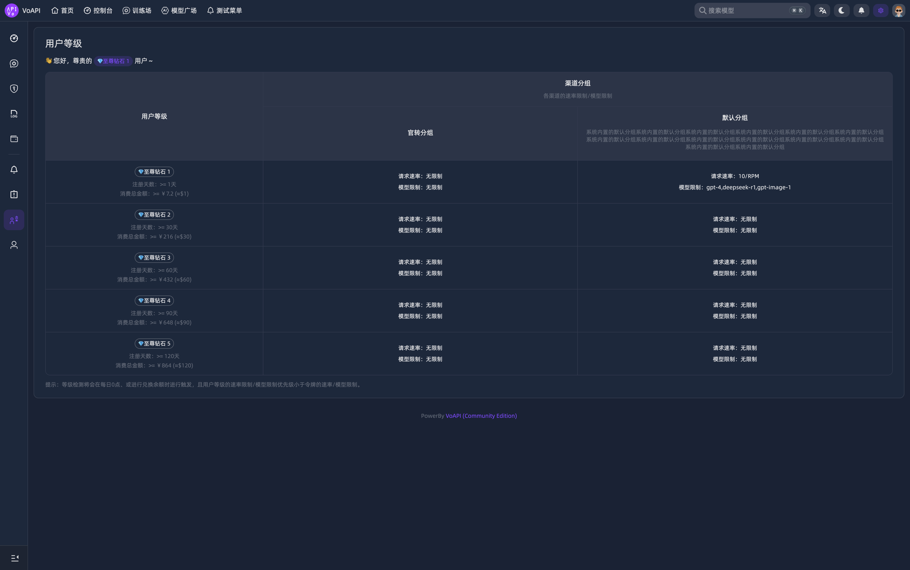
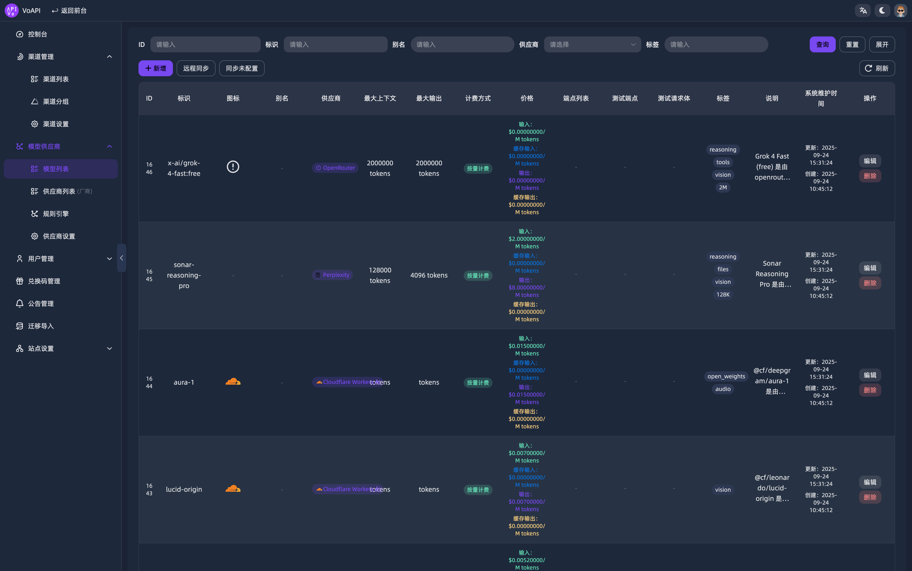
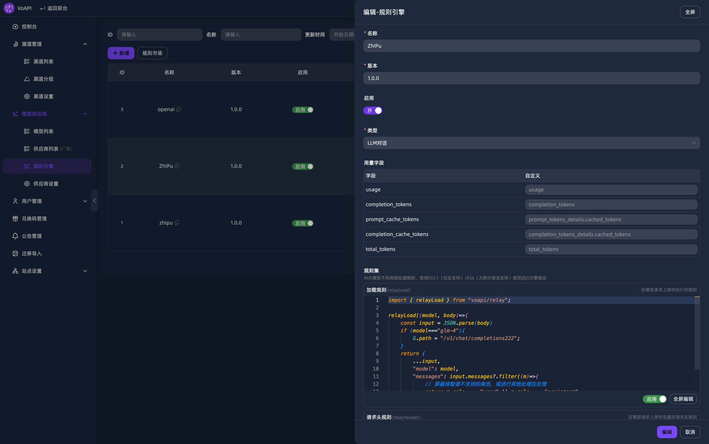
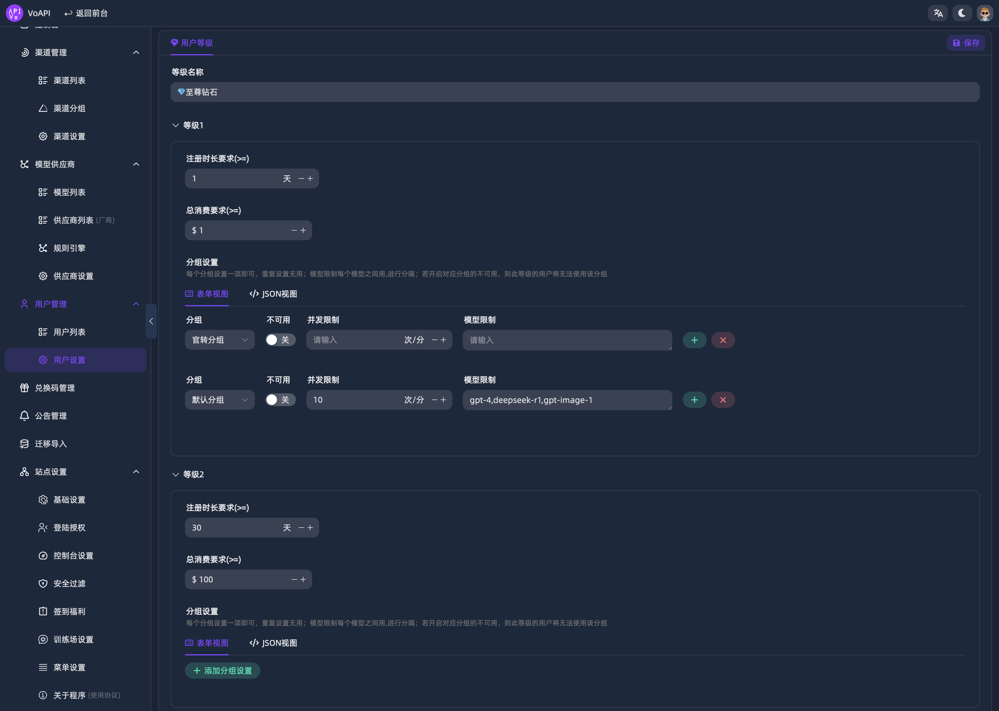
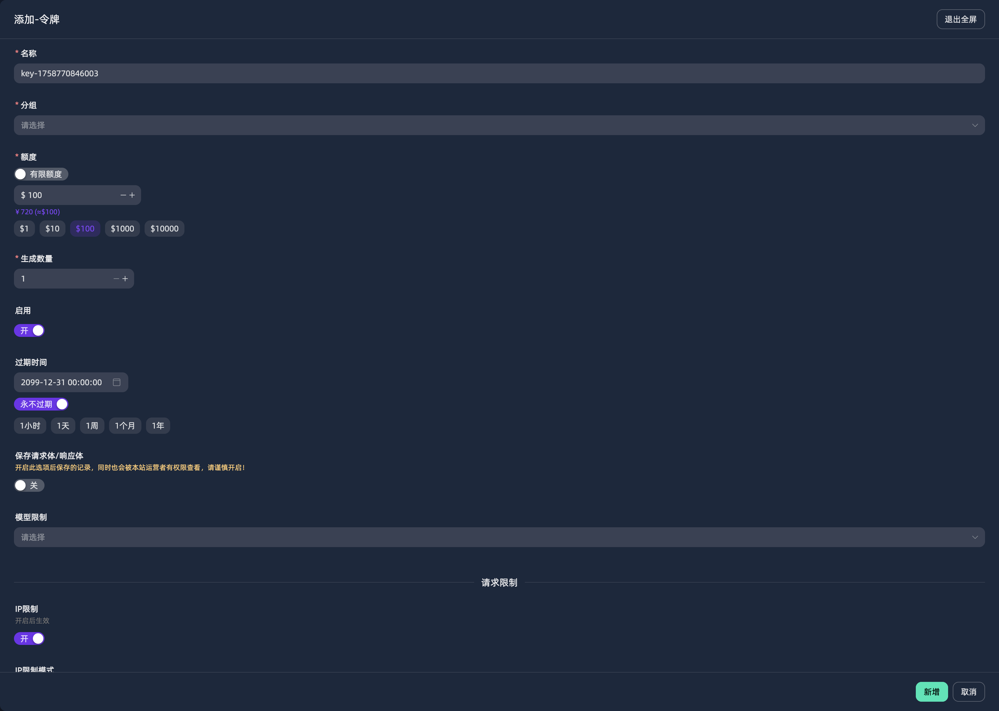
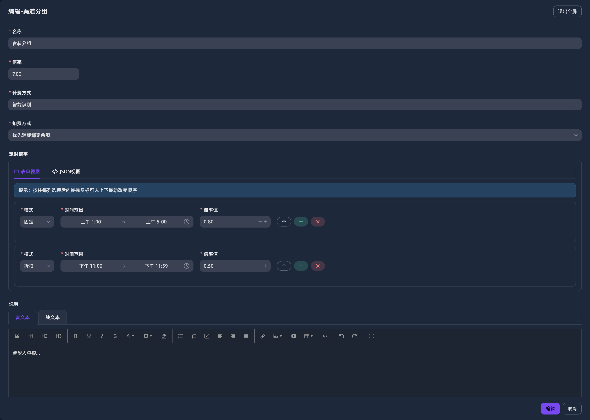

[简体中文](./README.md) | English

[](https://demo.voapi.top)

**🎉VoAPI's new architecture V1.0 has been fully released**
## Introduction
A brand-new, high-performance, and scalable AI model interface management and distribution system

|Features|Community Edition|Pro Edition|
|-|-|-|
|Basic Features|✅|✅|
|Register/Login with username or email address|✅|✅|
|Multi-user Management|✅|✅|
|Rule Engine Support (ES5/ES6 compliant JS syntax engine with custom rules)|✅|✅|
|API Data Forwarding Core Module|✅|✅|
|API Token|✅|✅|
|Multi-balance Mechanism|✅|✅|
|Multi-currency Mechanism (two built-in, Pro supports customization)|✅|✅|
|Daily Sign-in |✅|✅|
|Multiple user levels (5 built-in levels) |✅|✅|
|User real-time RPM and TPM support |✅|✅|
|Channel real-time RPM and TPM support |✅|✅|
|Channel single-key real-time RPM and TPM support |✅|✅|
|Training field customizable multiple external page embedding |✅|✅|
|Remote model and vendor data synchronization |✅|✅|
|Channel grouping support |✅|✅|
|Channel group fixed rate and timed rate support |✅|✅|
|Channel retry |✅|✅|
|Channel key error disable (can disable a single key or the model in the key for the current request) |✅ |✅|
|Channel key error disables automatic recovery mechanism|✅|✅|
|Channel request circuit breaker timeout mechanism|✅|✅|
|Channel IP and UA rule restrictions|✅|✅|
|Channel global/independent proxy configuration, supports HTTP[S] and Socket5 protocols|✅|✅|
|Redemption code system|✅|✅|
|Custom menu|✅|✅|
|Third-party login (GitHub, Gitee, LiunxDO)|✅|✅|
|Security filtering|✅|✅|
|API route display and speed test|✅|✅|
|API node status monitoring display|✅|✅|
|Customization SEO, theme tones and global styles, scripts, etc. |✅|✅|
|One-click third-party system data migration and import |✅|✅|
|Multi-priority billing |✅|✅|
|Log table sharding (automatically sharded by day/week/month/year) |✅|✅|
|i18n internationalization (built-in Chinese and English) |✅|✅|
|Model multi-conditional billing (tiered billing) is supported, with both fixed-price and basic multiplier pricing options |✅|✅|
|Pro-exclusive features, not yet announced |❌|✅|
|Actual features extend beyond the description above. Come experience it! |✅|✅|

## Deployment
### Architecture Images
- Linux amd64: `voapi/voapi`
- Linux arm64: `voapi/voapi-linux-arm64`

### Docker Compose Deployment
> Linux-arm64 users, please replace the image in docker-compose.yml with `voapi/voapi-linux-arm64`
```sh
git clone https://github.com/VoAPI/VoAPI.git
cd VoAPI
docker-compose up -d
```
After deployment is complete, visit http://localhost:6800 (please modify the domain name and port number as needed) to access the system. The first user registered will be the administrator account.

### Docker Single Container Deployment
> Please ensure you have prepared the MySQL and Redis databases and correctly configured the config.yml file.

> Linux-arm64 users, please replace the image with `voapi/voapi-linux-arm64`
```sh
docker run -d --name voapi --restart always -p 6800:6800 -e TZ=Asia/Shanghai -v ./config.yml:/config.yml -v ./file:/file -v ./public:/public voapi/voapi:latest
```

## Configuration file
- config.yml
```yaml
app:
    port: 6800 # Application listening port
mysql:
    dsn: root:@tcp(db-voapi:3306)/voapi # Primary database
    log-dsn: root:@tcp(db-voapi:3306)/voapi-log # Log sharding database
    log-body-dsn: root:@tcp(db-voapi:3306)/voapi-body-log # Request body log sharding database
    log-sharding: # Log sharding, supports day/week/month/year
        enable: false
        mode: y # d = day, w = week, m = month, y = year
redis:
    dsn: redis://redis-voapi:6379/0
    pool-size: 0 #Redis connection pool size. If it's 0, the default value is used, which is the number of CPUs * 100.
```

## Quickly Configure Your First Channel in the Backend
- The first registered user is the administrator. After logging in, click the purple gear icon in the upper-right corner to enter the backend management interface.
- First, in the "Model Supplier" module, under "Model List" and "Supplier List," click "Remote Synchronization" to synchronize the officially pre-configured models and suppliers.
- Then, in the "Rule Engine" section of the "Model Supplier" module, create a new blank rule engine. You can name it anything you want. Non-required fields are omitted for full transparent transmission.
- Then, create a new channel group in "Channel Management" - "Channel Grouping."
- Finally, create a new channel in "Channel Management" - "Channel List." Select the newly created rule engine and channel group.

## Recommended AI Clients
> [!NOTE]
> 🌻 GoAmzAI supports numerous powerful features:
> - Runs smoothly on servers as small as 1C/1GB
> - Fast, visual deployment with easy-to-understand configuration
> - Fully adaptive site support for PCs, tablets, and mobile phones
> - Low memory usage, native Golang development with high concurrency support
> - Includes numerous AI modules, including AI conversation, AI painting, AI music, AI video, AI PPT generation, PDF parsing conversation, and AI application support
> - Features a comprehensive operational mechanism, including but not limited to a package system, redemption code system, invitation rewards, sign-in benefits, promotion rebates, and more
> - [🫱 Click here to learn more and experience it](https://d.goamzai.com)

## Join the chat group
> You can also scan the QR code below to join the QQ chat group for the latest development updates and related events.
>
> Click the link to join the group chat: https://qm.qq.com/q/QFibUxMPEQ


## Screenshots
### PC










